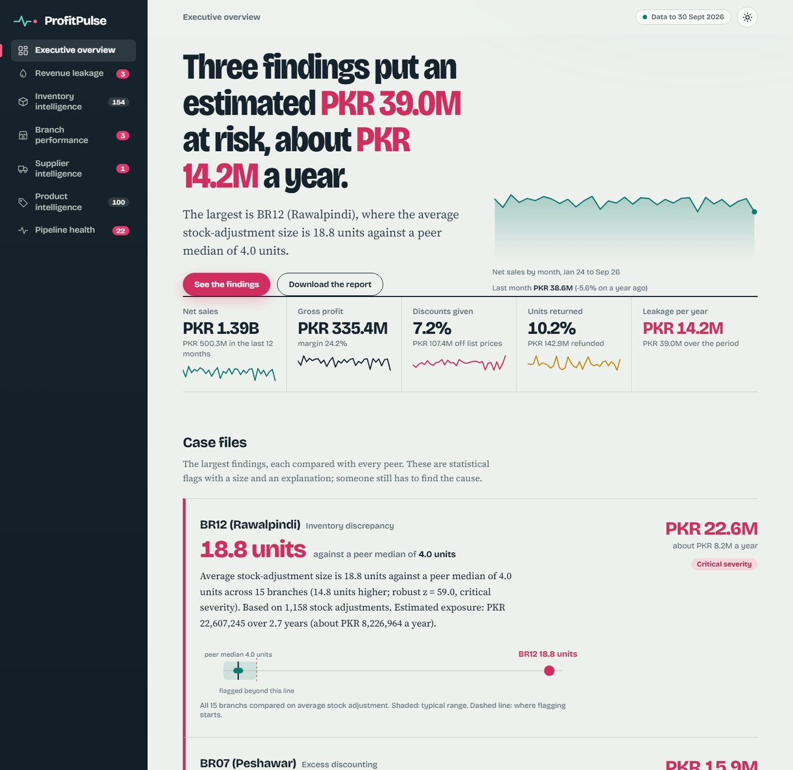
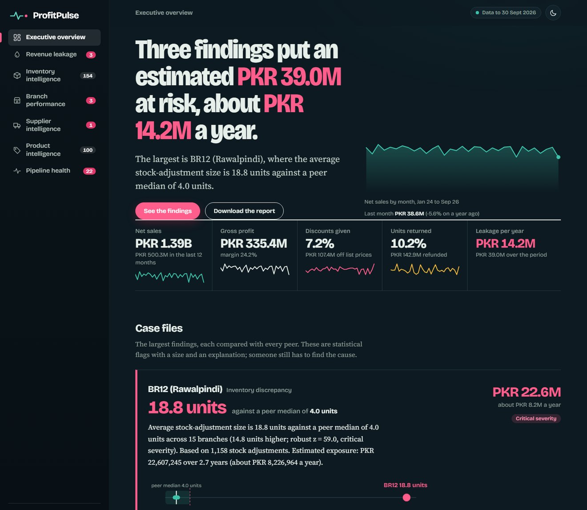
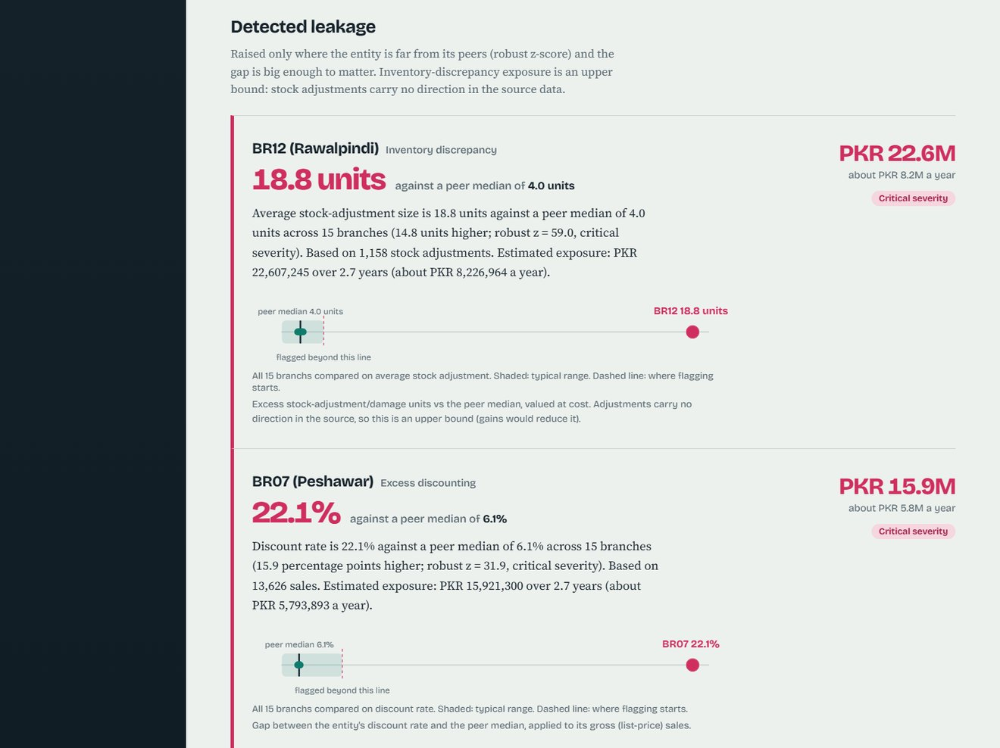
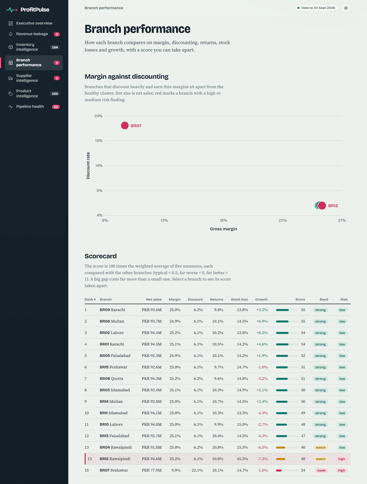
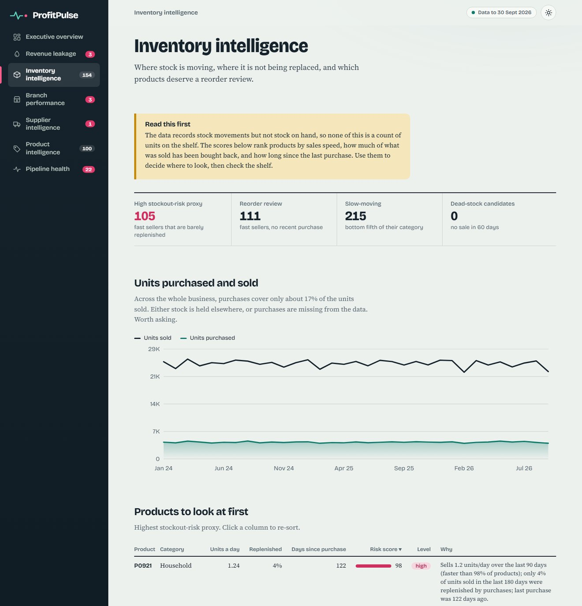
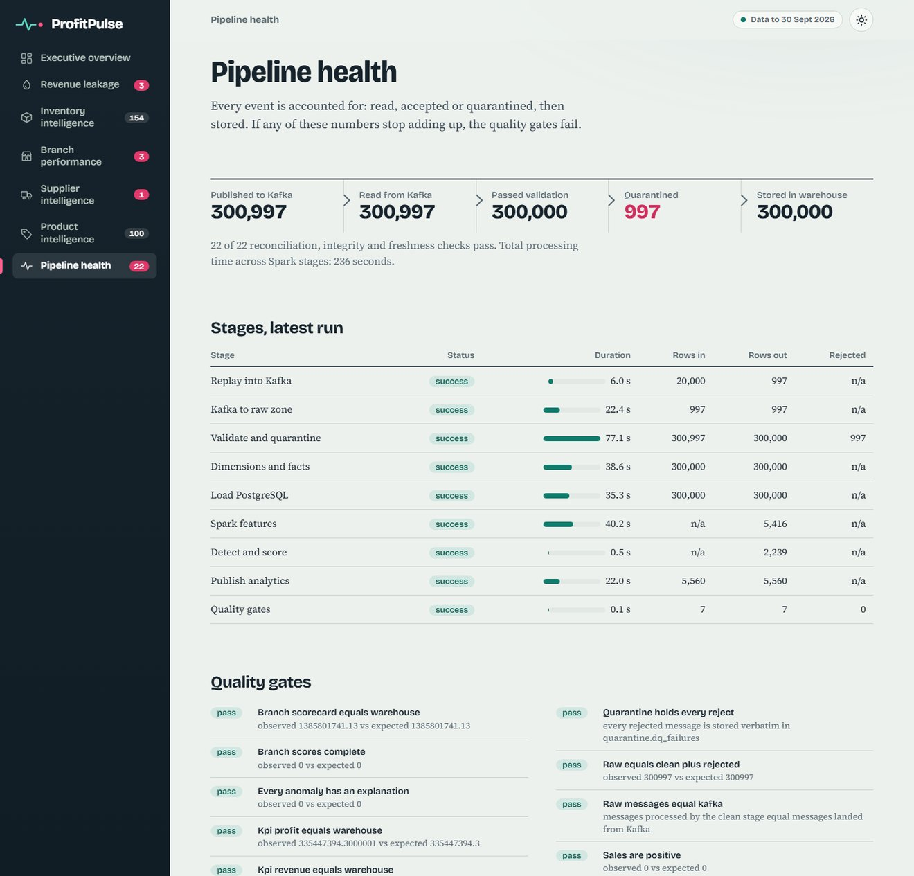
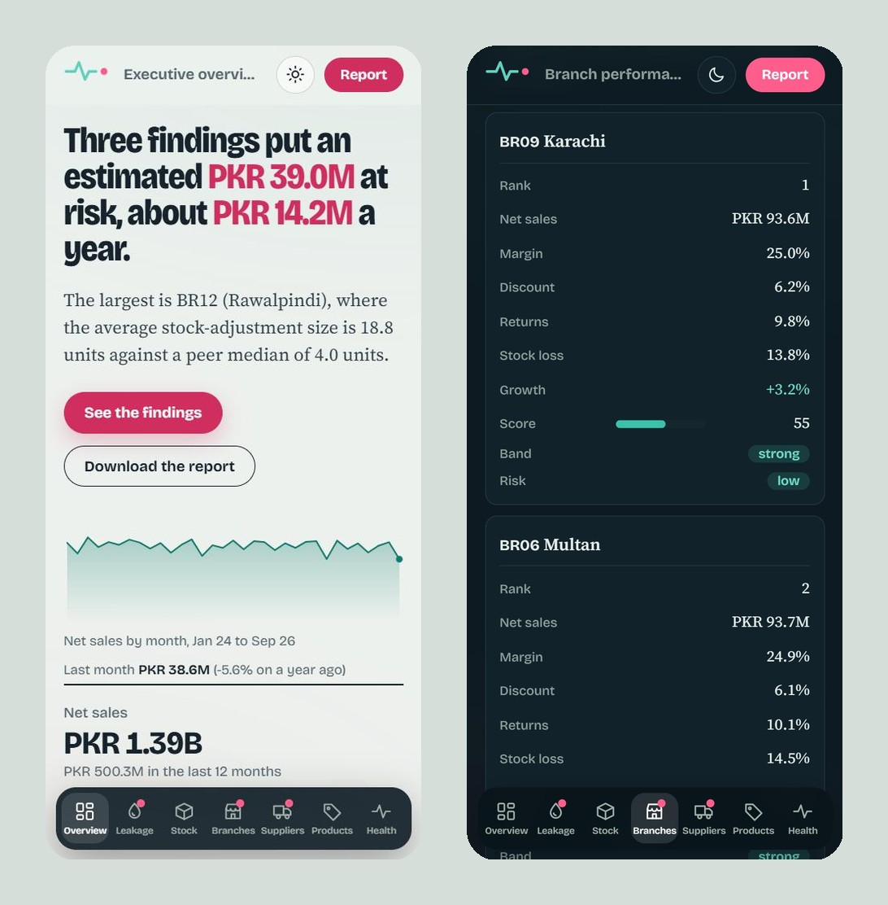
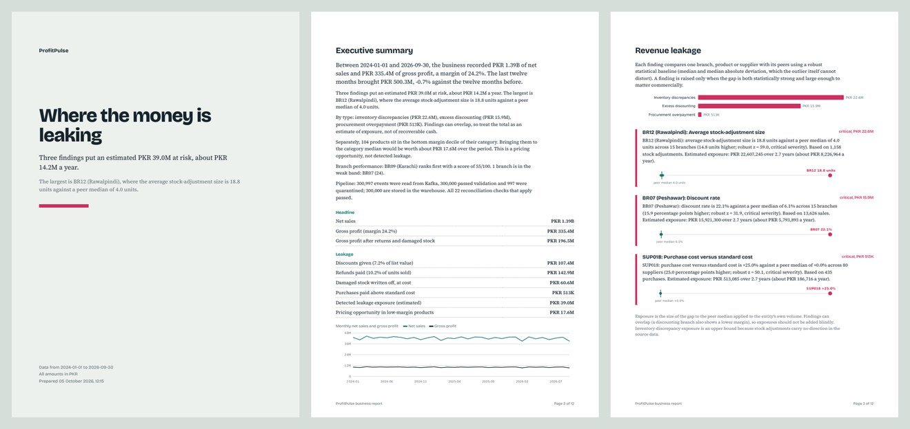

# ProfitPulse

**Business intelligence that finds where a retail or distribution business is losing money, and says why.**

ProfitPulse turns a stream of business events (sales, purchases, returns, stock adjustments, damage, price changes) into
explained findings: *"BR07 (Peshawar): discount rate is 22.1% against a peer median of 6.1% across 15 branches (robust z = 31.9, critical).
Estimated exposure PKR 15.9M over 2.7 years."* It is a complete, locally runnable data platform (Kafka, Spark, PostgreSQL, Airflow, Docker)
with a small web UI and a downloadable PDF/Excel business report.

## The problem

A business with 15 branches and 1,000 products generates thousands of events a day. Leaks hide in averages: one branch discounts three times as
much as the others, one supplier charges 25% above the agreed cost, one branch makes stock adjustments four times normal size. Each is invisible in a
company-wide total and obvious when each branch, product and supplier is compared with its peers. ProfitPulse does that comparison continuously,
sizes the money involved, and explains each finding in a sentence an owner can act on.

## What it found in the supplied dataset

300,000 synthetic events, 2024-01 to 2026-09, run end to end through Kafka, Spark, PostgreSQL and Airflow
(full numbers in [docs/VALIDATION_REPORT.md](docs/VALIDATION_REPORT.md)):

| | |
|---|---|
| Records | 300,000 read from Kafka, 300,000 accepted, 0 rejected, 300,000 stored. A later batch of 997 deliberately faulty messages was quarantined, 997 of 997, with the warehouse unchanged |
| Net sales / gross profit | PKR 1,385.8M / 335.4M (24.2% margin); matches an independent pandas calculation to the cent |
| Returns / discounts | 10.2% of units returned (PKR 142.9M refunded); 7.2% of list value discounted |
| Detected leakage | 3 findings, about **PKR 39.0M** of exposure (PKR 14.2M a year) |
| Inventory | 105 products at high stockout-risk proxy; 111 flagged for reorder review |
| Processing | 234 s of stage time (262 s wall-clock including Airflow gaps) for all 300,000 events, on a laptop |

The three findings, discovered **without any ID hard-coded in the logic**:

1. **BR12 (Rawalpindi)**: average stock adjustment 18.8 units vs a peer median of 4.0 (z = 59), PKR 22.6M upper-bound exposure.
2. **BR07 (Peshawar)**: 22.1% average discount vs 6.1% (z = 32); gross margin 9.9% vs 25%; PKR 15.9M of excess discounting.
3. **SUP018**: purchases priced 25% above standard cost on every order; PKR 513K overpaid.

A fourth pattern in the brief (abnormal returns on one product) is **not in the supplied file**: that product's return rate is 10.2% against a
10.0% median, ranked 459th of 1,000 (see [docs/DATA_PROFILE.md](docs/DATA_PROFILE.md)). The platform reports that honestly instead of manufacturing a
finding, and `scripts/make_variant_dataset.py` builds a copy with a real return anomaly to prove the detector would catch it.

## What it looks like

The interface is deliberately not a generic dashboard. Each finding is a **case file**: the figure that matters, a plain-English explanation, and a **peer strip**
that draws every peer as a dot (the flagged one in red, the shaded band is the typical range, the dashed line is where flagging starts), so you can see *why* it was flagged.
There are light and dark themes, animated entrances (all disabled under *reduce motion*), and a phone layout with a bottom tab bar.





Case files on the Revenue leakage page. Each shows the size of the problem, the comparison, the explanation and the evidence:



Branch performance: a margin-versus-discount scatter, and a scorecard that can be taken apart (select a branch to see where it loses points):



Inventory intelligence, with the data limitation stated before any number:



Pipeline health: every event accounted for. This capture was taken after a batch of 997 deliberately faulty messages was sent, so the quarantine count is visible:



On a phone, tables turn into cards and navigation moves to a bottom tab bar:



The downloadable PDF business report (cover, executive summary and leakage findings shown; 12 pages in total), alongside an 11-sheet Excel workbook:



## Architecture

```
CSV ─► producer ─► Kafka ─► Spark ingest ─► raw ─► Spark clean ─► cleaned ─► Spark transform ─► Spark load ─► PostgreSQL core
        replay,     6 topics   offsets in     Parquet   26 rules,     │          dims + facts      (staging +        │
        --rate,                PostgreSQL               quarantine ───┘                             merge)           ▼
        faults                                                                       Spark features ─► pandas detectors ─► analytics
                                                                                       (SQL over core)   (explainable)         │
                                          Airflow: ingestion ► transformation ► analytics ► data quality       web UI + PDF/XLSX / Power BI
```

Technology choices and what each is *for*: [docs/ARCHITECTURE.md](docs/ARCHITECTURE.md). In one line each: **Kafka** is the event transport with replay and
tracked offsets; **Spark** does validation, the star schema and the wide aggregations (set-based, cluster-ready via one setting); **PostgreSQL** serves the
analytical model with constraints and a read-only BI role; **Airflow** runs four dependent DAGs chained by data assets; **FastAPI** serves the UI and reports.
Not used because they were not needed: a Spark cluster, Kafka UI, Celery/Redis, a frontend build.

## Running it

All commands are run from the project folder (`D:\ProfitPulse` on the machine this was built on). They work in PowerShell, Command Prompt or Git Bash,
except where noted. The system needs Docker Desktop and about 8 GB of memory available to Docker.

### Every day: you just switched your PC on

Your data is stored in Docker volumes, so it is still there after a restart. You do **not** need to run the pipeline again.

**1.** Start **Docker Desktop** from the Start menu. Wait until it says "Engine running" (this can take a minute).

**2.** Open **PowerShell** and go to the project:

```powershell
cd D:\ProfitPulse
```

**3.** Start ProfitPulse (PostgreSQL, Kafka, Airflow, the web app):

```powershell
docker compose up -d
```

**4.** Check that everything is healthy (it takes about a minute and a half; if something says "starting", wait and run it again):

```powershell
docker compose ps
```

**5.** Open the app in your browser:

* http://localhost:18000 : the ProfitPulse UI (with the PDF and Excel downloads)
* http://localhost:18080 : Airflow (optional, to watch or trigger the pipelines)

When you are done for the day:

```powershell
docker compose stop        # stops the containers and keeps all data
```

### Process the data again (re-run the whole pipeline)

Only needed for new data, or to watch the pipeline work. It takes about 5 minutes for the 300,000 events.

```powershell
docker compose exec airflow-scheduler airflow dags trigger ingestion_pipeline
```

Watch it in Airflow at http://localhost:18080 (DAGs list). `ingestion_pipeline` runs first; `transformation_pipeline`, `analytics_pipeline` and
`data_quality_pipeline` then start by themselves as each one finishes. Refresh the app when `data_quality_pipeline` shows green.

Fault-injection demo (bad messages arriving later, which get quarantined). Re-running the full dataset a second time would only be rejected as duplicates, so use a
faults-only batch:

```powershell
docker compose run --rm tools python -m profitpulse publish --limit 20000 --corrupt-rate 0.05 --faults-only
docker compose exec airflow-scheduler airflow dags trigger ingestion_pipeline --conf '{\"publish_source\": false}'
```

(That quoting is for PowerShell. In Git Bash use `--conf '{"publish_source": false}'`.)

### First time on a new machine

```powershell
# 1. Install Docker Desktop and Python 3, then put the dataset here:
#    data\source\profitpulse_synthetic_dataset.csv

# 2. Create .env with random secrets (never committed to git)
python scripts\init_env.py

# 3. Build the images and start everything (the first run takes several minutes)
docker compose up -d --build

# 4. Run the pipeline, then open http://localhost:18000
docker compose exec airflow-scheduler airflow dags trigger ingestion_pipeline
```

### Useful commands

```powershell
docker compose ps                                                                 # what is running
docker compose logs -f web                                                        # live logs of one service (Ctrl+C to leave)
docker compose run --rm tools python -m profitpulse dq                            # run the data-quality gates now
docker compose run --rm tools python -m profitpulse validation-report --docs      # regenerate docs/VALIDATION_REPORT.md
docker compose run --rm tools python -m pytest tests/unit tests/spark tests/integration   # run the tests (e2e: tests/e2e, after a full run)
docker compose down -v                                                            # DELETES this project's containers and data
```

Without Airflow, for development (needs Git Bash): `scripts/run_stages.sh`.

### Where things are

| What | URL | Notes |
|---|---|---|
| ProfitPulse UI | http://localhost:18000 | seven pages; PDF and Excel downloads |
| Airflow | http://localhost:18080 | no login (bound to localhost only) |
| PostgreSQL | `localhost:15432` | database `profitpulse`; use the `pp_reader` role for BI tools |
| Kafka (host access) | `localhost:19092` | |

**Ports.** Host ports were chosen after inspecting the existing Docker environment (5432, 5433, 5434, 9092 to 9094, 8080 and 3306 were taken or reserved) and
are all bound to `127.0.0.1`. Change them in `.env` (`PP_*_HOST_PORT`) if they clash on your machine. Container-internal ports stay standard. The stack uses its
own Compose project, network and volumes (`profitpulse_*`) and never touches other containers.

### If something goes wrong

| Symptom | Cause and fix |
|---|---|
| `failed to connect to the docker API` | Docker Desktop is not running yet. Start it and wait for "Engine running". |
| `port is already allocated` | Another program uses one of the ports. Change the matching `PP_*_HOST_PORT` in `.env`, then `docker compose up -d`. |
| The app says "No analytics yet" | The pipeline has not run on this machine. Trigger `ingestion_pipeline` (see above). |
| Containers keep restarting, or Spark fails | Docker has too little memory. Docker Desktop, Settings, Resources: give it 8 GB or more. |
| `docker compose up` says a variable is not set | `.env` is missing. Run `python scripts\init_env.py`. |
| A DAG shows as paused in Airflow | Turn its toggle on in the DAGs list (new installs start unpaused). |

### Replay options

```powershell
docker compose run --rm tools python -m profitpulse publish --rate 50 --limit 5000            # simulate 50 events per second
docker compose run --rm tools python -m profitpulse publish --limit 5000 --corrupt-rate 0.02  # add faulty messages
```

The same options are parameters of `ingestion_pipeline` in Airflow. With `--corrupt-rate`, a fraction of events get an *additional* corrupted twin
(duplicate IDs, bad IDs, negative quantities, mismatched totals, malformed JSON, ...). The originals stay, so totals are unchanged and every injected fault must
show up in quarantine under its rule; the tests and the end-to-end run assert that.

## The web UI and the business report

Seven pages: Executive overview, Revenue leakage, Inventory intelligence, Branch performance, Supplier intelligence, Product intelligence, Pipeline health (screenshots above).
There is no login: ProfitPulse is deployed as one private instance per business, with that business's data, so there are no accounts to create.

**Business report** (left rail on a computer, the *Report* button on a phone) offers both formats, your choice:

* **PDF**: a 12-page business report: executive summary, leakage with explanations and peer strips, branch scorecard, suppliers, products, inventory (with the
  data limitation stated up front), pipeline reconciliation, and method and limitations.
* **Excel**: 11 sheets with filters, frozen headers and number formats (Summary, Findings, Leakage, Branches, Suppliers, Products, Inventory risk, Monthly,
  Data quality, Quarantine, Methodology).

The analytics DAG also renders both into the web service's `pp_web_reports` volume after each run (scheduled reporting).

## Data model

Star schema in `core`: dimensions `dim_date`, `dim_branch`, `dim_product`, `dim_supplier`; facts `fact_sales`, `fact_returns`, `fact_purchases`,
`fact_inventory_movements`, `fact_price_changes`, each with Kafka lineage. Plus `quarantine.dq_failures` (rejects kept verbatim), `ops.*` (runs, results, offsets),
and `analytics.*` (scorecards, anomalies, leakage, KPIs, BI views). Full detail: [docs/ARCHITECTURE.md](docs/ARCHITECTURE.md); migrations in `database/migrations/`.

## How it decides something is wrong

Robust peer comparison, no machine learning to explain away: `z = (value - median of peers) / (1.4826 x MAD)`, a minimum practical gap, a minimum sample, and a
temporal check against the entity's own history. Every finding gets an explanation and an exposure estimate. Branch scores are weighted, magnitude-aware, and stored
component by component. Definitions of every metric, rule and threshold: [docs/METRICS.md](docs/METRICS.md). Parameters: `config/analytics.yaml`, `config/rules.yaml`.

Two honest limits, both stated in the product: **the data has no stock on hand**, so inventory intelligence is movement-based proxies, and **stock adjustments have no sign**, so
inventory-discrepancy exposure is an upper bound.

## Testing

```bash
docker compose run --rm tools python -m pytest tests/unit tests/spark tests/integration     # needs: docker compose up -d postgres
docker compose run --rm tools python -m pytest tests/e2e                                      # after a complete pipeline run
```

126 tests: unit (detectors, scoring, contract, fault injection), Spark (every validation rule and every injectable fault, transform arithmetic against
hand-computed values), integration (migrations, constraints, merge semantics, role permissions), and end to end (warehouse and analytics versus an independent
pandas recomputation from the CSV; the detector versus independent statistics, without hard-coded IDs).

## Repository layout

```
airflow/dags/          four DAGs (ingestion, transformation, analytics, data quality)
config/                rules.yaml, analytics.yaml: every threshold and weight
database/migrations/   numbered SQL (core star schema, quarantine/ops, analytics, BI views)
docker/                Dockerfiles (pipeline image, web image), Postgres init
docs/                  architecture, metrics, data profile, dashboard guide, validation report
scripts/               init_env.py, run_stages.sh, make_variant_dataset.py
src/profitpulse/       kafka/ spark/ validation/ analytics/ quality/ web/ and the CLI
tests/                 unit, spark, integration, e2e
```

## Limitations

* Synthetic data; anomalies are constant over time, so temporal detection is exercised by tests rather than by the data.
* No stock on hand, unsigned adjustments, no link between a return and its sale, no delivery data (supplier reliability is a proxy: ordering rhythm and the return/damage rate of their products).
* Single-node Kafka and local-mode Spark; sized for hundreds of thousands to low millions of events. The path to a cluster is configuration plus the changes listed in the architecture doc.
* Currency is assumed to be PKR (configurable); timestamps carry no time zone.
* Airflow has no login because it is bound to localhost. Do not expose the stack to a network as is.
* Anomalies are statistical flags for investigation, not conclusions.

## Where this could go commercially

A hosted version that connects to a retailer's POS, ERP and purchasing exports; per-branch weekly "exceptions" emails written in the same plain language; supplier price-variance
alerts at purchase time rather than after the fact; configurable thresholds per business; stock-on-hand ingestion to turn the inventory proxies into real days-of-cover; and a
benchmark against anonymised peers. The engineering here (replayable events, quarantine, reconciled layers, explainable detection) is the part that has to be right before any of that.

## Author

Built by **Ali Raza**.

## Licences

Fonts are bundled under the SIL Open Font License (see `src/profitpulse/web/static/fonts/OFL-*.txt`). No licence has been chosen for this repository's code yet.
